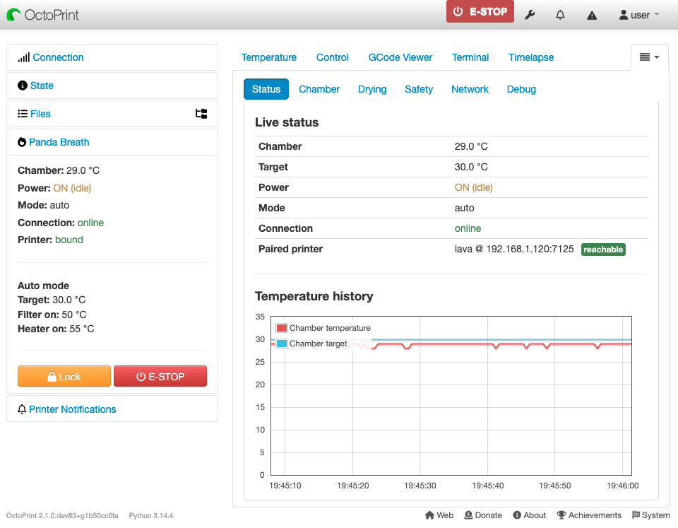

<!-- markdownlint-disable MD041 MD033 -->
<p align="center">
  
</p>
<h1 align="center">OctoPrint‑PandaBreath</h1>
<!-- markdownlint-enable MD041 MD033 -->

[](https://github.com/Ajimaru/OctoPrint-PandaBreath/blob/main/LICENSE)
[](https://python.org)
[](https://octoprint.org)
[](https://github.com/Ajimaru/OctoPrint-PandaBreath/releases/latest)
[](https://github.com/Ajimaru/OctoPrint-PandaBreath/releases)
[](https://github.com/Ajimaru/OctoPrint-PandaBreath)

### Direct WebSocket control of the BIQU Panda Breath chamber heater from OctoPrint

<!-- markdownlint-disable MD033-->

<!-- markdownlint-enable MD033-->

## Highlights

- 🔥 **Chamber Control** - Target, mode (auto / manual / dry) and power directly from OctoPrint
- 📊 **Dedicated Tab** - Status / Chamber / Drying / Safety / Network / Debug subtabs with a Flot temperature chart (~30 min history)
- 🧪 **Filament Drying** - PLA / PETG-ABS / Custom presets, target + timer in one transaction, start/stop and a live countdown
- 🌬️ **Auto Mode** - Independent heater and filter-fan activation thresholds tied to the bound printer's hotbed
- 📡 **MQTT Control Bridge (V1.0.4+)** - Day-to-day control/status over the Panda's broker path, while WebSocket remains the safety/setup backbone
- 🔌 **Native Protocol** - Talks the Panda Breath WebSocket protocol — no Bambu emulation required
- 💓 **Keepalive + Auto-Reconnect** - Periodic query frames and a self-healing reconnect loop survive Panda Breath firmware pauses
- 🛡️ **Observe-Only Mode** - Safe default: connect, decode and display without sending any write frames
- 🚨 **Emergency Stop** - Sidebar + Safety-tab E-Stop, mirrors the device's own Work-Mode-off behaviour
- 🖨️ **Print Integration** - Optional auto-on at print start, auto-off at print end / cancel / fail
- 📜 **GCODE Hooks** - `M141` / `M191` from your slicer re-target the chamber automatically
- 🔐 **Permission-Gated** - Separate STATUS / CONTROL / ADMIN permissions for fine-grained access
- 🔍 **Frame Debug + Disk Log** - Live ring buffer and an optional persistent JSONL log for protocol troubleshooting
- 🔒 **TLS Support** - Optional `wss://` with custom CA / client cert / key

## Installation

### Via Plugin Manager (Recommended)

1. Open OctoPrint web interface
2. Navigate to **Settings** → **Plugin Manager**
3. Click **Get More...**
4. Click **Install from URL** and enter: `https://github.com/Ajimaru/OctoPrint-PandaBreath/releases/latest/download/OctoPrint-PandaBreath-latest.zip`

5. Click **Install**
6. Restart OctoPrint

### Manual Installation

<!-- markdownlint-disable MD033 -->
<details>
<summary>Manual pip install</summary>

`pip install https://github.com/Ajimaru/OctoPrint-PandaBreath/releases/latest/download/OctoPrint-PandaBreath-latest.zip`

The `releases/latest` URL always points to the newest stable release.

</details>
<!-- markdownlint-enable MD033 -->

## Configuration

Access plugin settings via **OctoPrint Settings → Plugins → PandaBreath**.

> ⚠️ **Start in Observe-Only mode.** The plugin defaults to read-only and rejects every write command (HTTP API and MQTT-routed control). Only disable this once you have verified frame traffic in the debug panel and confirmed your device address.

### Step 1 — Connect to the Panda Breath

| Setting | Default | Description |
| --- | --- | --- |
| **Transport** | `client` | `client` connects to the Panda Breath's own WS server. Use `server` only for Bambu-emulation setups. |
| **Panda Breath IP / host** | _(empty)_ | IP or hostname of the device, e.g. `192.168.1.50`. The `ws://` (or `wss://` when TLS is on) prefix and `/ws` path are added automatically. The adapter stays idle while this is blank. |

For `server` transport (Bambu-emulation), the **Pairing** section appears with `Bind Host`, `Bind Port`, `Host IP`, `Serial Number` and `Access Code` — fill these from your emulation config. In `client` mode against real hardware these are not needed.

### Step 2 — Verify with Observe-Only

1. Save settings. The plugin restarts the adapter automatically.
2. Open the **PandaBreath** sidebar widget — connection state should flip to **connected**.
3. Enable **Show debug panel in plugin tab** under _Plugin Settings → Debug_, then open the plugin tab's **Debug** subtab to inspect live frames.
4. Confirm you see periodic status frames carrying the current chamber temperature.

If you do not see frames within ~10 s, check the **Panda Breath IP / host** value and the OctoPrint log for adapter errors.

### Step 3 — Enable Control

Once you trust the connection:

1. Uncheck **Observe-Only**.
2. Set **Max Temperature** to your chamber's safe ceiling (default `70 °C`).
3. Adjust **Timeout** (default `15 s`) if your network is flaky.
4. Use the **Chamber** subtab to turn power on, pick a mode and set a target.

### Safety Settings

| Setting | Default | Description |
| --- | --- | --- |
| **Observe-Only** | ✅ enabled | Suppresses every write frame. Safe default — disable consciously. |
| **Max Temperature** | `70.0 °C` | Hard ceiling. Targets above this are rejected. |
| **Timeout** | `15.0 s` | Watchdog timeout — locks the controller if no status arrives in this window (auto-released on the next received frame). |
| **Reconnect Delay** | `5.0 s` | Base wait between reconnect attempts on WS drop (exponential backoff up to 60 s). |

### MQTT Control (optional, firmware V1.0.4+)

Enable this if your Panda Breath is already bound to an MQTT broker (for example via the device's **Bind a Broker** menu).

| Setting | Default | Description |
| --- | --- | --- |
| **MQTT Enabled** | ⬜ disabled | Routes operational control through MQTT when available. |
| **Broker Host / Port** | _(empty)_ / `1883` | Broker endpoint the plugin connects to. |
| **Allow MQTT Control** | ✅ enabled | Accepts inbound MQTT commands from the broker topic handler. |

When the MQTT bridge is active, chamber control writes are sent over MQTT; WebSocket remains active for setup/safety functions and status capture.

### Print Integration

| Setting | Default | Description |
| --- | --- | --- |
| **GCODE Integration** | ✅ enabled | Intercept `M141` / `M191` from the print stream and re-target the chamber. |
| **Auto-On at Print Start** | ⬜ disabled | Switch to AUTO mode and apply the start target when a print begins. |
| **Print-Start Target** | `40.0 °C` | Target temperature applied when auto-on triggers. |
| **Auto-Off at Print End** | ✅ enabled | Set target to 0 and turn the heater off on print done / cancel / fail. |
| **Navbar E-Stop** | ✅ enabled | Show the emergency-stop button in the OctoPrint navbar. |

### TLS (optional)

Only relevant if your device or network policy requires `wss://`.

| Setting | Default | Description |
| --- | --- | --- |
| **TLS Enabled** | ⬜ disabled | Switch the client to `wss://`. |
| **CA File** | _(empty)_ | Path to a custom CA bundle. Admin-only. |
| **Client Cert / Key** | _(empty)_ | Mutual-TLS material. Admin-only. |
| **TLS Insecure** | ⬜ disabled | Skip certificate verification — diagnostics only, **do not leave on**. |

### Permissions

PandaBreath registers three permissions, all assigned to the **Admins** group by default. Add them to other groups via OctoPrint's Access Control to delegate access:

- `PLUGIN_PANDABREATH_STATUS` — read chamber state (sidebar, API GET)
- `PLUGIN_PANDABREATH_CONTROL` — change target, mode, heater on/off
- `PLUGIN_PANDABREATH_ADMIN` — lock / unlock the safety interlock, trigger E-Stop

## Usage

### Sidebar Widget

Read-only status view: chamber temperature, power, mode, connection, bound printer, plus a mode-specific summary (manual setpoint / auto thresholds / dry preset and countdown). Lock / Unlock / E-STOP buttons sit at the bottom.

### Panda Breath Tab

Subtabs:

- **Status** — live status table + temperature chart
- **Chamber** — power, mode, target, auto-mode thresholds
- **Drying** — filament presets, custom target+timer, start/stop, live countdown
- **Safety** — lock / unlock / E-Stop with safety banner
- **Network** — paired printer + reachability, Panda Breath LAN/AP, firmware, recent device responses
- **Debug** — frame ring buffer and persistent log management (visible when the debug panel is enabled)

### Emergency Stop

Available in the sidebar, the Safety subtab and (optionally) the navbar. Sends a single `work_on:false` frame — matches the Panda Breath's own Work-Mode-off behaviour, which stops any running dry cycle on its own. Engages a local safety lock; an admin must Unlock to resume writes.

### GCODE Control

With **GCODE Integration** enabled, your slicer can drive the chamber via standard chamber-temp commands:

```gcode
M141 S40   ; set chamber target to 40 °C (no wait)
M191 S40   ; set chamber target to 40 °C and wait
```

The commands are swallowed before they reach the printer firmware, so unsupported boards won't complain.

## Contributing

Contributions are welcome! Please see [CONTRIBUTING.md](CONTRIBUTING.md) for detailed guidelines and instructions.

Please also follow our [Code of Conduct](CODE_OF_CONDUCT.md).

## License

MIT - See [LICENSE](LICENSE) for details.

This plugin ports protocol details from [BIQU-Panda-Breath-Mod](https://github.com/jeng37/BIQU-Panda-Breath-Mod) and [chamber_control](https://github.com/bula87/chamber_control) — both MIT-licensed. Upstream license texts are reproduced under [licenses/](licenses/).

## Support

- 🐛 **Bug Reports**: [GitHub Issues](https://github.com/Ajimaru/OctoPrint-PandaBreath/issues)
- 💬 **Discussion**: [GitHub Discussions](https://github.com/Ajimaru/OctoPrint-PandaBreath/discussions)

Note: For troubleshooting, enable **Show debug panel** and **Persist WS frames to disk** under _Plugin Settings → Debug_, then use the plugin tab's **Debug** subtab to inspect live frames and download the persistent log.

## Credits

- **Development**: Built following [OctoPrint Plugin Guidelines](https://docs.octoprint.org/en/main/plugins/index.html)
- **Protocol References**: [BIQU-Panda-Breath-Mod](https://github.com/jeng37/BIQU-Panda-Breath-Mod), [chamber_control](https://github.com/bula87/chamber_control)
- **Contributors**: See [AUTHORS.md](AUTHORS.md)

## 100% Badge Coverage

Summary: this project exposes many status and quality badges (CI, linting, coverage, releases, maintenance, etc.). The full badge set is available below; click to expand for details.

<!-- markdownlint-disable MD033 -->
<details>
<summary>Show all badges</summary>

### 🏗️ 1. Build & Test Status

[](https://github.com/Ajimaru/OctoPrint-PandaBreath/actions/workflows/ci.yml?query=branch%3Amain)
[](https://github.com/Ajimaru/OctoPrint-PandaBreath/actions/workflows/i18n.yml?query=branch%3Amain)
[](https://github.com/Ajimaru/OctoPrint-PandaBreath/actions/workflows/lint.yml?query=branch%3Amain)
[](https://github.com/Ajimaru/OctoPrint-PandaBreath/actions/workflows/docs.yml?query=branch%3Amain)
[](https://github.com/Ajimaru/OctoPrint-PandaBreath/actions/workflows/bandit-sarif.yml?query=branch%3Amain)

### 🧪 2. Code Quality & Formatting

[](https://github.com/psf/black)
[](https://pycqa.github.io/isort/)
[](https://github.com/prettier/prettier)
[](https://pre-commit.com/)
[](https://app.codacy.com/gh/Ajimaru/OctoPrint-PandaBreath/dashboard)
[](https://app.codacy.com/gh/Ajimaru/OctoPrint-PandaBreath)
[](https://codecov.io/gh/Ajimaru/OctoPrint-PandaBreath)
[](https://codecov.io/gh/Ajimaru/OctoPrint-PandaBreath)
[](https://www.pylint.org/)
[](https://bandit.readthedocs.io/en/latest/)
[](https://depfu.com/repos/github/Ajimaru/OctoPrint-PandaBreath)
[](https://snyk.io/test/github/Ajimaru/OctoPrint-PandaBreath)

### 🔄 3. CI/CD & Release

[](https://semver.org/)
[](https://github.com/Ajimaru/OctoPrint-PandaBreath/releases)
[](https://github.com/Ajimaru/OctoPrint-PandaBreath/releases/latest)
[](https://github.com/Ajimaru/OctoPrint-PandaBreath/releases)
[](https://github.com/Ajimaru/OctoPrint-PandaBreath/releases)
[](https://python.org)
[](https://octoprint.org)
[](https://github.com/Ajimaru/OctoPrint-PandaBreath/graphs/commit-activity)

### 📊 4. Repository Activity

[](https://github.com/Ajimaru/OctoPrint-PandaBreath/issues?q=is%3Aissue%20state%3Aopen)
[](https://github.com/Ajimaru/OctoPrint-PandaBreath/issues?q=is%3Aissue%20state%3Aclosed)
[](https://github.com/Ajimaru/OctoPrint-PandaBreath/pulls?q=is%3Apr+is%3Aopen)
[](https://github.com/Ajimaru/OctoPrint-PandaBreath/pulls?q=is%3Apr+is%3Aclosed)
[](https://github.com/Ajimaru/OctoPrint-PandaBreath/commits/main)
[](https://github.com/Ajimaru/OctoPrint-PandaBreath/graphs/commit-activity)
[](https://github.com/Ajimaru/OctoPrint-PandaBreath/graphs/contributors)

### 🧾 5. Metadata


[](https://github.com/Ajimaru/OctoPrint-PandaBreath/blob/main/SECURITY.md)
[](https://app.snyk.io)


[](https://github.com/Ajimaru/OctoPrint-PandaBreath/blob/main/LICENSE)
[](https://github.com/Ajimaru/OctoPrint-PandaBreath/pulls)

</details>
<!-- markdownlint-enable MD033 -->

---

  

**Like this plugin?** ⭐ Star the repo and share it with the OctoPrint community!
